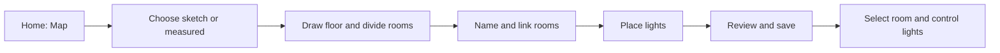

# Home Map: UX and delivery plan

Status: **implementation started; core foundation first**. Updated: **2026-09-06**.

Track completed commits and the remaining small implementation chunks in
[Home Map progress](./home-map-progress.md). The UI flows below remain the target
experience until their corresponding chunks are delivered.

## Product direction

Add **Dashboard / Map** to Home and remember the chosen view per bridge. Map
is a top-down floor plan for recognizing spaces and controlling their lights.
Its editing tools appear only in **Edit map**.

Offer both creation options, as requested:

- **Quick sketch:** draw and snap approximate room shapes; measurements stay hidden.
- **Measured plan:** enter wall lengths, choose metric or imperial units, and
  display dimensions. Use the same editor and saved geometry.

Inherit Mote's current typography, theme tokens, controls, and light colors.
Keep walls legible and room labels stable. Use restrained room tint and light
markers to communicate actual lighting; selection has its own outline.

The useful precedent is separating map editing from choosing rooms for an
action. Roborock documents both [merge/divide editing](https://support.roborock.com/hc/en-us/articles/360030486432-How-do-I-merge-or-divide-rooms-on-the-map)
and [room selection](https://support.roborock.com/hc/en-us/articles/360030816731-Can-I-make-the-robot-cleaner-clean-specific-rooms).
The flows below are proposals for Mote.

## Screen structure

| Region          | Everyday use                                                      | Edit map                                                          |
| --------------- | ----------------------------------------------------------------- | ----------------------------------------------------------------- |
| Header          | Existing bridge selector; Dashboard / Map; floor picker; Edit map | Floor name; Undo / Redo; Save and close                           |
| Main canvas     | Rooms, names, power buttons, light markers                        | Grid, walls, handles, live operation preview                      |
| Left panel      | Optional searchable room list                                     | Steps during setup; rooms and unplaced lights afterward           |
| Right inspector | Selected room or light controls                                   | Name, dimensions, room link, and selected operation               |
| Canvas tools    | Zoom, Fit floor, lights visibility                                | Select, Draw, Divide, Combine, Place lights, snapping, dimensions |

The canvas remains visible when selecting a room. Keep the inspector in a
stable position instead of opening controls over whichever room was clicked.
At narrow window widths, use an overlay inspector with a clear back action;
room selection and all controls remain available in the room list. Avoid
squeezing the map between two permanent sidebars.

## First-time setup

1. **Create your map.** Show a small example and the two drawing options.
   Explain that a rough plan is enough to control lights. Name the first floor,
   initially "Ground floor"; additional floors get separate canvases.
2. **Draw the floor.** Start with a rectangle, an L-shaped outline, or draw an
   outline corner by corner. Rectangle width and depth can be typed. Clicking
   the starting point closes an outline; Enter also finishes a valid shape.
   Offer **Add adjoining room** for users who think room by room.
3. **Divide into rooms.** Select an area, choose Divide, and draw from one wall
   to another. Snap endpoints, show both resulting shapes, then apply. Repeat
   as needed. A division is a logical room boundary; a doorway need not break
   the polygon. Simple bends can support L-shaped rooms.
4. **Name and connect rooms.** Selecting a region opens its name and **Controls**
   picker. Existing Hue rooms come first with their light count. Linking imports
   the name, icon, members, and scenes; it does not guess the home's shape.
   An unlinked region can remain a named space with no lighting controls.
5. **Place lights.** The tray shows the selected room's lights, grouped by
   device where useful. Drag a light onto the map, or select it and click a
   position. **Identify** briefly signals the physical lamp. Show progress such
   as "4 of 6 placed" and keep unplaced lights accessible.
6. **Review and save.** Show a small summary of mapped rooms, unplaced lights,
   and any requested Hue changes. Save the draft locally, commit the reviewed
   Hue operations, resolve returned resource IDs, then publish valid map links.
   Enter control mode with the first linked room selected after success.

Setup is progressive: one linked room is enough to start using Map. Every
completed edit autosaves a recoverable draft. **Save and close** publishes the
valid draft as the everyday map; **Discard draft** restores the last saved map.
Neither finishing every room nor placing every light is required.

An operation's **Apply** updates the local draft only. **Save and close** is the
explicit commit point for queued Hue changes. If any required operation fails,
keep the previous published map and retain the new draft with each operation's
result. Retry unresolved work, or remove failed operations and review again.
Successfully created Hue resources already exist externally; retain their IDs
for reconciliation and never recreate them merely because the map was not
published. Use this same save boundary during later map editing.

## Drawing and measured editing

Both modes offer grid and wall snapping, visible handles, zoom/pan, and
keyboard nudging. Tool help follows the current operation, for example
"Click a wall to start the divider." Escape cancels the unfinished operation;
Undo / Redo acts on completed map edits.

Rooms may take any shape. Walls run at any angle, three corners are enough, and
snapping offers 90, 45, and 15 degree steps as well as free drawing. Right
angles remain the default because most homes have them, not because the model
requires them. Walls shared by two rooms are one editable boundary: moving it
updates both rooms in a single preview. Reject crossing walls, open regions,
overlaps, and unusably small slivers before applying the edit. Explain a failed
division beside the line: "Connect this line to the opposite wall."

In measured mode:

- Choose meters/centimeters or feet/inches; store physical lengths in meters.
- Click a dimension label to enter a length. Anchor one endpoint and preview
  which connected walls and rooms will move before accepting the change.
- Preserve shared boundaries. If an entered length conflicts with an existing
  constraint, identify the conflict and let the user release that constraint.
  Do not silently stretch a measured neighboring room.
- Show dimensions in the editor; everyday Map has an optional dimensions toggle.
- Switching a sketch to measured mode starts with **Set scale**: select one
  known wall, enter its real length, and preview the rescaled floor. Other
  dimensions are derived estimates until the user verifies them.
- Switching dimensions off changes presentation, not geometry. Changing units
  also preserves geometry. Measurements describe the user's plan, not a survey.
- Returning to Quick sketch hides measurement labels but preserves entered
  length constraints. Constrained walls show a lock when selected; **Release
  length** explicitly allows dragging to change that length. Entering a length
  constrains it; marking a derived dimension as verified does not lock it
  automatically. Show verification and locking as separate properties.

Doors, windows, furniture, angled/curved walls, image tracing, and automatic
recognition can follow after the core editor. Measured orthogonal drawing is
part of the requested first complete version, rather than an indefinite add-on.

## Room identity, splitting, combining, and naming

Keep a **drawn area** separate from its **lighting control target**. In the first
version, a linked area targets one existing Hue room or zone. The inspector
always identifies that target and lists all its members, including unplaced
lights. Marker coordinates never determine command scope implicitly.

| Action                               | Geometry result                                     | Lighting result                                                                                              |
| ------------------------------------ | --------------------------------------------------- | ------------------------------------------------------------------------------------------------------------ |
| Rename on map                        | Changes the map label                               | Hue name stays; an explicit "Rename Hue room too" action can change it                                       |
| Move a wall or marker                | Changes shape or position                           | Membership and scenes stay                                                                                   |
| Divide, keep one control             | Two named areas                                     | Both deliberately share the original target; selecting either highlights both and says "Controls both areas" |
| Divide, control separately           | Two named areas                                     | Link two existing targets, or explicitly create zones for the reviewed light subsets                         |
| Combine areas with the same target   | One shape, choose a label                           | Original target and scenes remain                                                                            |
| Combine areas with different targets | Preview one shape                                   | Link a suitable existing zone, or explicitly create a zone containing the reviewed union of lights           |
| Remove from map                      | Removes shape/link; affected markers go to Unplaced | Hue rooms, lights, and scenes remain                                                                         |
| Create an actual Hue room            | Adds a linked target after success                  | Explicit device membership change, with source rooms and affected devices listed                             |

**Divide flow:** select area → draw boundary → preview two areas → name each →
choose shared or separate control → review affected lights → apply. Placed
lights suggest subsets; unplaced lights and markers on the new boundary need
an explicit assignment. Keep their original positions whenever possible.

**Combine flow:** Combine → drag one room onto another, or click two rooms that
touch and then the dot that appears on the wall between them → confirm on the
map → apply. The room dropped on, or the one picked first, keeps its name and
Hue link, so combining never asks for a name. Disconnected areas use a zone for
combined control while keeping separate shapes. Never invent a wall or corridor
between them.

When independent controls require new groups, recommend Hue zones: they allow
light subsets without moving devices out of their existing physical Hue rooms.
The review must say that the zones will also appear in Hue and Mote's dashboard.
If the user cancels group creation or bridge capacity prevents it, retain the
draft and offer an existing target or shared control.

**Create Hue room** and **Move devices to this room** are explicit management
actions for users who want to reorganize Hue itself. Hue rooms contain devices;
a multi-light device moves as a unit. Preview the complete affected device and
light list. Combining map geometry never deletes source Hue rooms.

Scenes belong to their original Hue room/zone. A new zone starts with its own
scene set; offer to create scenes or explicitly copy compatible scenes after
creation. Do not present a parent room's scene as a smaller area's scene, or
pretend equally named scenes form one combined scene. Explain when a real Hue
membership change can affect existing scenes.

## Light placement

- Show room membership and placed/unplaced state separately.
- Dropping inside the linked room moves a marker only.
- Dropping outside the current target offers **Move marker only** or a specific
  membership action. For a Hue room destination, use **Move device to room**
  and list all affected light services. For a zone destination, use **Add light
  to zone**; preserve its physical room and other zone memberships. Queue these
  actions for review/save. A marker-only move shows its actual control target
  in the details and flags the mismatch in edit mode, with a move-back action.
  Controls follow the explicit target, not the visual drop location.
- A wall resize that leaves a marker outside its area marks it for repositioning;
  it does not move the physical device's room membership.
- Provide click-to-place and list-based assignment alongside dragging. Keyboard
  users can choose a room and a coarse position, then nudge with arrow keys.
- Each light has one physical marker per map. Overlapping zones reuse that
  marker; they do not create copies of the same lamp.
- New lights appear in Unplaced. Deleted lights become clearly missing in the
  editor until removed or relinked. Unplaced lights remain controllable through
  their room and inspector.

## Everyday lighting controls

| User action                        | Result                                                          |
| ---------------------------------- | --------------------------------------------------------------- |
| Click room surface or its list row | Select room and open its inspector; keep map context            |
| Click explicit room power button   | Toggle the room directly; do not trigger room navigation        |
| Use room brightness slider         | Adjust that target through existing paced group controls        |
| Click favorite scene in inspector  | Apply immediately; show pending, applied, or failed state       |
| Click light marker                 | Open the existing light controls with a back action to its room |
| Click empty canvas / press Escape  | Clear selection; preserve current light state                   |
| Click All off on this floor        | Turn off the distinct mapped targets on the selected floor      |

Inspector order: **room name and status → power → brightness → favorite scenes
→ lights → manage room**. Show a few pinned scenes first, then **All scenes**.
Favorite scene selection/order is a proposed map preference. Reuse the existing
scene controls and give users access to the existing full room screen for
advanced tasks. Once a room is selected, changing its scene is one click.

Room labels can include a small power button when there is enough space; the
inspector always exposes the full control. Tiny rooms use external labels and
the synchronized list. Keep the overview free of a full scene palette and
brightness slider inside every polygon.

Show **Off**, **On**, **Some lights on**, **Unavailable**, and **Syncing** with
text/icons as well as color. When any controllable light is on, the room power
action turns the controllable target off; otherwise it turns it on. Reuse the
current brightness policy and expose mixed values as "Mixed" rather than
implying every lamp has the displayed average.

Follow live bridge state across the canvas and inspector. A recently requested
scene is not proof it is still active after someone changes a lamp. Honor the
existing Entertainment/PC Sync exclusions and identify excluded lights.

**All off on this floor** shows its scope/count. If a shared Hue target includes
lights on another floor or outside the floor's resolved membership, disable
this floor action and offer to create an exact floor zone from a reviewed light
list. Enable it only when its targets affect precisely that floor. Count unique
lights across overlapping targets and deduplicate target IDs. The first
version must not send a broad grouped command under a floor-only label.
Whole-bridge control remains a separately labeled action.

Apply scope visibility to ordinary room controls and scenes too: show the
actual target, highlight every linked area on the current floor, and disclose
off-floor/outside-area lights beside the controls. The inspector's complete
member list remains authoritative. Shared control across floors cannot be
communicated solely by highlighting visible polygons.

## States, recovery, and accessibility

- **Bridge offline:** retain the map, show last-known state as stale, disable
  live controls, and allow local geometry edits. Do not queue lighting actions
  for unexpected replay when the bridge returns.
- **Partial failure:** show which Hue operations succeeded and which failed,
  refresh resources, and retry only unresolved work. Preserve the geometry draft
  and successfully created IDs. Map Undo never claims to undo committed Hue
  operations; successful Hue changes remain visible even if a draft is discarded.
- **Membership changed elsewhere:** refresh the target's members, flag mismatched
  placements, and show new/unplaced lights. A deleted target becomes unlinked;
  never silently bind another room with the same name.
- **Empty/decorative room:** retain its name and outline; offer Link lights;
  show no fake power state.
- **Multiple floors:** remember selection and viewport per floor. Removing a
  floor names the affected map rooms, supports local undo, and preserves Hue
  resources. Start with one floor and expose Add floor on demand.
- **Keyboard and screen readers:** synchronized room/light list, named buttons,
  visible focus, keyboard geometry adjustments, and text feedback for changes.
  Drawing, placement, and group selection must not depend on dragging alone.
- **Small targets and motion:** labels and controls retain usable screen-space
  hit areas during zoom; hide low-priority detail before it overlaps. Respect
  reduced motion and preserve contrast in both themes.

## Implementation boundaries

This is a plan, not a proposed rewrite of the shared state or SSE layer.

| Existing source                                                                        | Intended reuse or constraint                                                                      |
| -------------------------------------------------------------------------------------- | ------------------------------------------------------------------------------------------------- |
| `src/features/home-screen/HomeScreen.tsx` and `components/SpaceTile.tsx`               | Home view switch, room state, power/brightness behavior                                           |
| `src/routes/SpaceRoute.tsx`, `src/routes/RootLayout.tsx`, `src/features/space-screen/` | Existing inspectors, scenes, and full room navigation                                             |
| `src/stores/HueResourcesStore.tsx`                                                     | Live resources and control actions; preserve sync exclusions                                      |
| `src/hooks/useBlinkLights.ts`                                                          | Identify during placement                                                                         |
| `src/features/settings-screen/components/RoomZoneWizard.tsx`                           | Room/zone selection, creation, and device review patterns                                         |
| `src/features/space-screen/spaceEditActions.ts`                                        | Scene copying and explicit membership operations; account for partial failure                     |
| `src/features/entertainment-placement/`                                                | Assess reusable coordinate and pointer helpers; entertainment placement remains a separate domain |
| `src/router.tsx`                                                                       | Extend the actual hash-history/search-state patterns for view, floor, and inspector selection     |
| `src/App.css`                                                                          | Existing theme, typography, selection, and control styling                                        |

Add feature-local map geometry, editor state, and persistence under
`src/features/home-map/`. Keep physical vertices/shared boundaries, area IDs,
labels, optional dimensions, light positions, and target references separate
from live lighting state. Use a single coordinate model independent of screen
size, and a schema version with validated migrations.

Prefer SVG for the first floor renderer, with semantic HTML controls and a
synchronized list. Select geometry tooling only after a focused proof of
split/union correctness and shared-wall dimension editing. The measured editor
needs validated constraints; a raw collection of draggable polygons is
insufficient.

Persist maps and recoverable drafts in a dedicated local Tauri store, keyed by
the active bridge ID. Use stable local map/floor/area IDs and bridge-scoped Hue
v2 references. Room/zone writes target `groupedLightId`; scene recall targets
the scene UUID. Hue's documented room geometry does not provide wall/polygon
storage, so the home plan remains Mote-owned.

The initial map covers one active bridge, with several floors. Future shared
homes and provider-neutral identity should follow the existing
[homes plan](./homes-and-membership-plan.md),
[multi-bridge plan](./multi-bridge-experience-plan.md), and
[multi-provider plan](./multi-provider-platform-plan.md). Cloud map sync,
multiple simultaneous bridges/providers, and cross-room scene recipes are
separate follow-ups. Keep home geometry local by default and out of telemetry.

Hue constraints were checked against local
[core concepts](./HUE/core-concepts.md) and the
[v2 reference](./HUE/hue-clip-api-v2.md), particularly room/zone children,
scene group membership, and room geometry.

## Delivery sequence and acceptance

Keep core editor/state work and frontend interaction polish in separate,
sequential implementation tasks, as required by `AGENTS.md`.

1. **Geometry and persistence foundation:** validate shared boundaries,
   split/combine operations, dimensional constraints, undo/redo, drafts, and
   round-trip save/load with pure tests. No Hue writes or animation work.
2. **Map controls vertical slice:** use a sample floor linked to real resources;
   prove selection, room power, brightness, scenes, light inspectors, offline
   state, and sync exclusions through existing actions.
3. **Creation editor:** quick and measured flows, names/links, floor management,
   placement/Identify, accessible alternatives, and review/save UX.
4. **Explicit Hue organization:** separate task for zone/room creation,
   membership review, scene handling, capacity errors, and partial-failure
   recovery. Geometry edits already work independently.
5. **Interaction polish and usability checks:** visual hierarchy, snapping
   feedback, keyboard/zoom behavior, narrow windows, and theme/motion QA.

The first complete release includes both sketch and measured orthogonal plans,
divide/combine/name, light placement, floors, and everyday controls. Validate
these concrete journeys before calling it complete:

- A new user maps one room, places one identified light, and turns the room off
  without completing the entire home.
- A measured rectangle and L-shaped floor retain entered lengths after editing,
  unit changes, window resizing, and reopening.
- Dividing a living/dining area into separate controls affects only the reviewed
  lights; no inherited scene unexpectedly controls the other area.
- Combining areas preserves physical markers and existing Hue resources; undo
  restores geometry and never conceals a successful external change.
- A light moved visually keeps a visible, correct control target until its
  membership is explicitly changed.
- Offline, deleted-resource, busy/syncing, partial-failure, keyboard-only, and
  small-room cases remain understandable and recoverable.

Success is completing those tasks with clear control scope. Setup-time and
task-completion targets should be set from usability testing, not assumed here.
